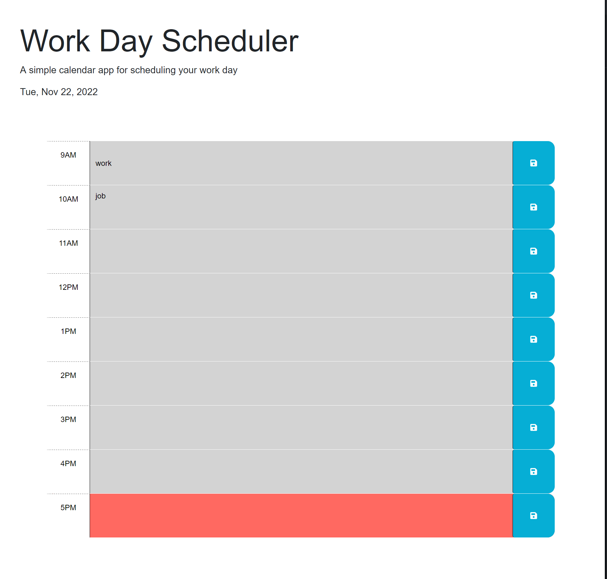

# Work Day Scheduler

The purpose of this application is to function as  a simple calendar application that allows a user to save events for each hour of the day by modifying starter code. 
## Usage

As an employee with a busy schedule this application will allow the usre to add important events to a daily planner so that they can manage their time effectively. When opening the planner to create a schedule the user is diplayed the current day and presented with timblocks for standard business hours. When the user views the timeblocks for that day each timeblock is color coded to indicate whether it is in the past, present, or future. When the user clicks into a timeblock they can enter an event. When the user saves the event they are presented with a notifcation letting them know it was saved to local storage and will persist upon refreshing the page. 
## Screenshots

## Link
(<https://parkercf.github.io/Work-Day-Scheduler/>)

## Features

- powered by jQuery
- Dynamically updated HTML
- Dynamically updated CSS
- uses local storage 

## License

[MIT](https://choosealicense.com/licenses/mit/)

